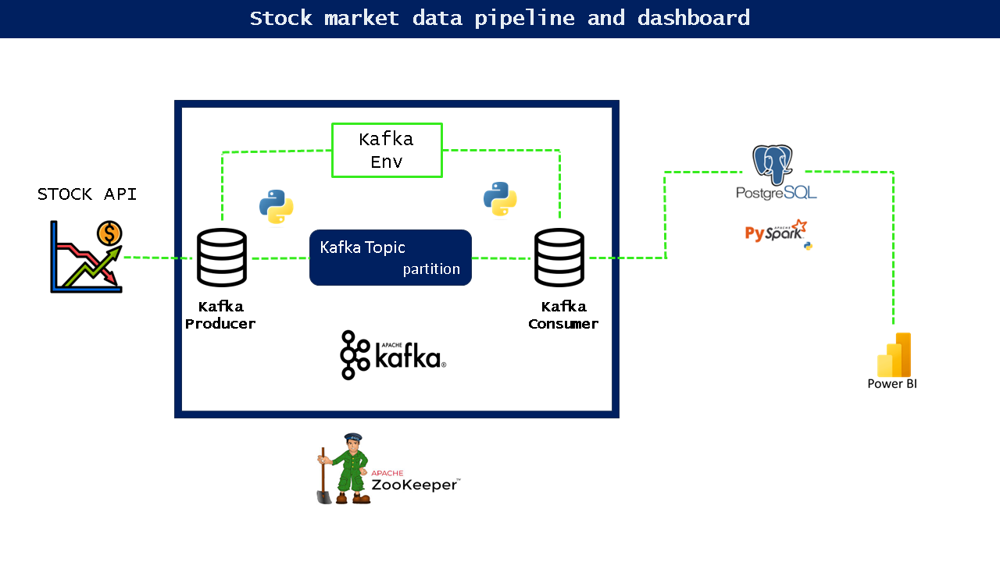
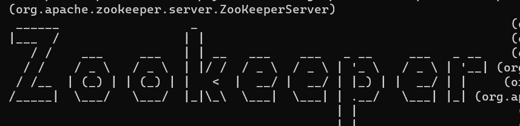

# Project Title: Stock market data pipeline and dashboard using Apache Kafka, postgresql and Power BI

**Description**:

This project demonstrates how to create a simple data pipeline to extract data from a stock market api and to dump the data into a sql database. (Postgresql) 

The project is a hands-on demonstration of how to design and implement a basic data pipeline to extract real-time stock market data from a public API and store it efficiently in a PostgreSQL database.

## In this project, we aim to achieve the following objectives:

**Data Extraction**: 

We will explore and select a suitable stock market API to retrieve financial data, such as stock prices, trading volumes, and other relevant information.

**Data Transformation**: 

After obtaining the data from the API, we will preprocess and transform it to ensure that it aligns with the schema of our target database. This step involves data cleaning, formatting, and organizing the retrieved data.

**PostgreSQL Setup**: 

We will set up a PostgreSQL database that will act as our storage repository for the stock market data. We will define the necessary tables and columns to accommodate the extracted data.

**Data Loading**: 

Once the PostgreSQL database is ready, we will design a script to load the transformed data into the appropriate tables. This involves establishing a connection to the database, processing the data, and executing SQL commands to insert the data efficiently.

## Database Connection and Dashboard Development: 

We will connect the databases we develop and create an analytical dashboard with the data to understand data patterns. Leveraging popular data visualization techniques, the dashboard will include charts, graphs, and other visualizations to provide stakeholders with insights into the data.

# Skills and Technologies:

**Apache Kafka**

**Zookeeper**

**Postgresql**

**Python**

**SQL**

**PySpark**

**AWS S3**

**AWS Redshift**

**PowerBi/tableau (for dashboard development)**

**Data preprocessing and visualization techniques**

## Overview

# Setting requirements

Before proceeding with the data pipeline project, ensure that you have properly configured your machine to run Apache kafka, zookeeper,Spark. 
For more details on configuration, refer to the official documentation: [Apache Kafka documentation](https://kafka.apache.org/documentation/)

## Download Apache Binaries:

Use the wget command to download the Apache binaries. 

           wget https://dlcdn.apache.org/spark/spark-3.4.1/spark-3.4.1-bin-hadoop3.tgz
           wget https://downloads.apache.org/kafka/3.5.1/kafka-3.5.1-src.tgz
           wget https://www.apache.org/dyn/closer.lua/zookeeper/zookeeper-3.9.0/apache-zookeeper-3.9.0-bin.tar.gz

Once the download is complete, extract the apache archives using the following command:

           tar -xvzf spark-3.4.1-bin-hadoop3.tgz
           tar -xvzf kafka-3.5.1-src.tgz
           tar -xvzf apache-zookeeper-3.9.0-bin.tar.gz
           
## Set Environment Variables:

Add the APACHE binary path and other environment variables to your .bashrc or .bash_profile file. 

    export PATH="/path/to/apache/bin:$PATH"

## Source the Updated File:

Source the updated .bashrc or .bash_profile file to apply the changes immediately.

           source ~/.bashrc

           source ~/.bash_profile
           
## note about zookeeper:

**Configure ZooKeeper (optional)**:

ZooKeeper comes with a default configuration file (zoo.cfg), but you can customize it according to your needs. The configuration file contains parameters like data directory, client port, tick time, etc. If you want to customize the configuration, you can do it before starting ZooKeeper.

**Start ZooKeeper**:

To start ZooKeeper, you need to run its server. The command to start ZooKeeper varies depending on your operating system.

**On Unix-like systems (Linux, macOS)**:

Open a terminal and navigate to the ZooKeeper installation directory (where the bin folder is located) and use the following command:

    ./bin/zkServer.sh start

Or you can run zookeeper from kafka as well:

    ./bin/zookeeper-server-start.sh config/zookeeper.properties

**On Windows**:

Open Command Prompt or PowerShell and navigate to the ZooKeeper installation directory and use the following command:

    bin\zkServer.cmd start
    
## Start Kafka Server:

To start Kafka, open a new terminal and navigate to the Kafka installation directory where the bin folder is located and use the following command:

**On Unix-like systems (Linux, macOS)**:

    ./bin/kafka-server-start.sh config/server.properties

## Create kafka basic env

**Create a Topic**:

To create a topic, you can use the kafka-topics.sh (or kafka-topics.bat on Windows) command-line tool that comes with Kafka. 

Open a terminal or command prompt and navigate to the Kafka installation directory. Then, use the following command to create a topic:

**On Unix-like systems (Linux, macOS)**:

    ./bin/kafka-topics.sh --bootstrap-server localhost:9092 --create --topic your_topic_name --partitions 3 --replication-factor 1

**On Windows**:

    bin\windows\kafka-topics.bat --bootstrap-server localhost:9092 --create --topic your_topic_name --partitions 3 --replication-factor 1

Replace your_topic_name with the desired name for your topic. 

The --partitions option specifies the number of partitions in the topic, and the --replication-factor option sets the replication factor for each partition. 

Adjust these values based on your requirements.

**Set Up a Producer**:

To create a Kafka producer, you can use the kafka-console-producer.sh (or kafka-console-producer.bat on Windows) command-line tool. 

This producer reads data from the console and sends it to the specified topic. 

Open another terminal or command prompt (while keeping Kafka running) and use the following command:

**On Unix-like systems (Linux, macOS)**:

    ./bin/kafka-console-producer.sh --broker-list localhost:9092 --topic your_topic_name

**On Windows**:

    bin\windows\kafka-console-producer.bat --broker-list localhost:9092 --topic your_topic_name

Replace your_topic_name with the name of the topic you created in the previous step. 

Now, anything you type in the console will be sent as a message to the specified topic.

**Set Up a Consumer**:

To create a Kafka consumer, you can use the kafka-console-consumer.sh (or kafka-console-consumer.bat on Windows) command-line tool. 

This consumer reads messages from the specified topic and displays them on the console.

Open yet another terminal or command prompt (while keeping Kafka running) and use the following command:

**On Unix-like systems (Linux, macOS)**:

    ./bin/kafka-console-consumer.sh --bootstrap-server localhost:9092 --topic your_topic_name --from-beginning

**On Windows**:

    bin\windows\kafka-console-consumer.bat --bootstrap-server localhost:9092 --topic your_topic_name --from-beginning

Replace your_topic_name with the name of the topic you created. 

The --from-beginning option ensures that the consumer starts from the beginning of the topic and reads all existing messages.

Now, you have a basic Kafka setup with a topic, producer, and consumer. You can experiment by typing messages into the producer's terminal and observing them being received by the consumer. Keep in mind that these examples use the command-line tools for simplicity. In real-world scenarios, you would typically use Kafka clients in your preferred programming language to create more sophisticated producers and consumers.

## Data Extraction from API

After configuring the kafka environment, you will implement the data extraction process from the selected stock market API. Use the Python script provided in this project to fetch the data from the API. Make sure to replace the nasdaq_api_key with your API key and set the nasdaq_endpoint to the desired endpoint for the stock data you want to retrieve.

## Create a PostgreSQL Database

Now, you'll create a PostgreSQL database to store the fetched stock market data. 

Start PostgreSQL Server:

**On Linux/macOS**: 

Open a terminal and enter the following command to start the PostgreSQL server:

           sudo service postgresql start
**On Windows**: 

Open the Command Prompt or PowerShell as an administrator and start the PostgreSQL service with:

           net start postgresql

Open a new terminal or command prompt window.

For local connections, you can use the psql command-line client. 

Enter the following command to connect to the PostgreSQL server with the default settings:

           psql -U postgres

-U specifies the username to connect with. By default, the superuser username is "postgres."

If your PostgreSQL server is running on a different host or port, you can specify the host and port using the -h and -p options, respectively. 

**For example**:

           psql -U postgres -h localhost -p 5432
           
Replace "localhost" with the IP address or domain name of the server if it's running on a different machine.

If prompted, enter the password for the PostgreSQL user.

You should now be connected to the PostgreSQL server, and the psql command prompt will appear, allowing you to execute SQL commands and interact with the database.

**Create a database to dump the date**.

           createdb mydatabase

Replace "mydatabase" with the desired name of your new database.

If the database is created successfully, you should see a message confirming the creation.

Use the provided PostgreSQL credentials (postgres_host, postgres_port, postgres_database, postgres_user, and postgres_password) to establish a connection to the database.

## Establishing the Connection**:

In Python, you can use the psycopg2 library to connect to PostgreSQL and interact with the database. psycopg2 is a popular PostgreSQL adapter for Python that allows you to execute SQL commands and manage the database connections effectively.

Import the psycopg2 library in your Python script.

Use the psycopg2.connect() function to establish a connection to the PostgreSQL server by passing the appropriate credentials.

If the connection is successful, you will obtain a connection object that you can use to execute SQL commands on the database.

**Creating Tables**:

Once the connection is established, you can use SQL commands to create the necessary tables in the PostgreSQL database to store the stock market data. The table schema should match the structure of the data you fetched from the API. You define the table names, column names, data types, constraints, and other properties using SQL CREATE TABLE statements.

For example, you might create a table called stock_data with columns like date, open, high, low, close, and wap to store the stock market data fields.

You can create a schema or use the public schema by default.

           CREATE TABLE IF NOT EXISTS public.stock_data (
               date DATE,
               open NUMERIC,
               high NUMERIC,
               low NUMERIC,
               close NUMERIC,
               wap NUMERIC
           );
           
**Configure Access for Local Connections**:

Ensure that your PostgreSQL configuration allows local connections. 

Modify the PostgreSQL server configuration file (postgresql.conf) to listen on the appropriate IP address and port (typically, localhost and default port 5432). Additionally, update the pg_hba.conf file to grant access for local connections to the database with the provided credentials.

You can configure your server using the command:

           sudo nano /path/to/pg_hba.conf

**Dump API Data to PostgreSQL**:

Once the connection to the PostgreSQL database is established, run the Python script to fetch the data from the API and store it in the PostgreSQL database. 

The save_to_postgresql(data) function in the script handles the data insertion into the appropriate table. After running the script, verify that the data has been successfully stored in the database.

**Connect PostgreSQL to Power BI using odbc**:

Ensure that you have installed the PostgreSQL ODBC driver on your computer. 

You can download and install the driver from the PostgreSQL website. https://odbc.postgresql.org

To configure an ODBC connection for PostgreSQL in Windows, you'll need to follow these steps:

Install PostgreSQL ODBC Driver:

Download and install the PostgreSQL ODBC driver suitable for your system from the official PostgreSQL website.

**Set up ODBC Data Source**:

Open the "ODBC Data Source Administrator" on your Windows machine. You can find it by searching for "ODBC Data Sources" in the start menu or searching for "ODBC" in the Control Panel.

Under the "User DSN" or "System DSN" tab (depending on whether the connection will be available for all users or only the current user), click the "Add" button.

Choose the PostgreSQL ODBC driver from the list of drivers installed in your system.

**Configure the Connection**:

In the configuration window, provide the necessary connection details:

Data Source Name: 

Give your ODBC data source a name (e.g., "MyPostgreSQL").

**Description*: 

Optionally, add a description for your reference.

**Server*: 

Enter the address or IP of your PostgreSQL server.

**Port*: 

The port number where your PostgreSQL server is running (default is 5432).

**Database*: 

The name of the database you want to connect to.

**Username and Password*: 

Enter the PostgreSQL credentials to authenticate.

Test the connection to ensure it's working correctly.

**Save the Configuration**:

Click "OK" to save the ODBC data source configuration.

## Connect ODBC to Power BI:

Open Power BI and click on "Get Data" from the Home tab.

Select "More..." to view all data connection options.

In the "Get Data" window, search for "ODBC" and select "ODBC" from the list of available data sources.

Choose the PostgreSQL ODBC driver from the list of ODBC data sources and click "Connect."

In the ODBC dialog box, enter the connection details for your PostgreSQL database, such as server name, database name, username, and password.

Click "OK" to establish the connection to your PostgreSQL database.

Power BI will load the data from PostgreSQL through the ODBC connection. You can use the Power Query Editor to perform any necessary data transformations or cleanup.

Create interactive visualizations, charts, and reports based on the data imported from PostgreSQL to gain insights.

Save and publish your Power BI report to share it with stakeholders or embed it in other applications.

By following these steps, you will have successfully connected PostgreSQL to Power BI using the ODBC driver, enabling you to analyze and visualize data from your PostgreSQL database in Power BI.

## Lessons Learned

**Integration Complexity**: 

Integrating multiple technologies, such as PostgreSQL, Kafka, and Power BI, can be complex. It is crucial to plan and understand the intricacies of each system to ensure a smooth integration process.

**Data Pipeline Reliability**: 

Building a reliable data pipeline is essential for real-time data analysis. Ensuring data integrity, handling data updates, and managing potential failures are critical aspects of a robust pipeline.

**ODBC Configuration**: 

Configuring ODBC connections to accept PostgreSQL-Kafka connections can be challenging. Proper documentation and understanding of the ODBC driver settings are crucial to establish successful connections.

**Data Transformation and Cleaning**: 

The Power Query Editor in Power BI is a powerful tool for data transformation and cleaning. Learning to use it effectively can significantly enhance data visualization and analysis.

**Data Visualization**: 

Building interactive and insightful visualizations is a skill that requires practice and creativity. Understanding the audience's needs and conveying data insights effectively are crucial for successful data visualization.

**Data Security**: 

Ensuring data security and managing user access to the PostgreSQL database is of utmost importance. Implementing appropriate security measures and following best practices is essential to protect sensitive information.

**Continuous Learning**: 

Working with various technologies and tools requires continuous learning and staying up-to-date with the latest developments. Regularly exploring new features and improvements can lead to more efficient workflows.

**Scalability Considerations**: 

As the project involves real-time data, scalability should be a key consideration. Ensuring that the system can handle increased data volume and user load is crucial for long-term success.

**Documentation and Knowledge Sharing**: 

Comprehensive documentation and knowledge sharing among team members are essential for seamless project maintenance and troubleshooting.

By reflecting on these lessons learned, future projects can benefit from improved planning, execution, and overall success in integrating PostgreSQL, Kafka, and Power BI to analyze real-time data effectively.

## Contact

Please feel free to contact me if you have any questions at: https://www.linkedin.com/in/felipe-mauriz-rodrigues/
