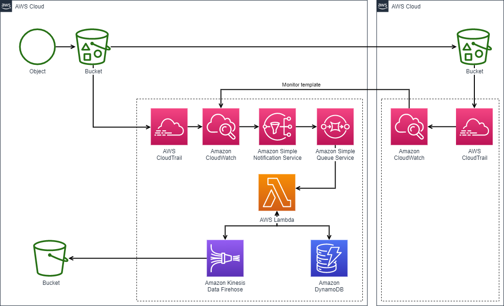

# Project Title: Stock market data pipeline and dashboard using Apache Kafka, postgresql and Power BI

**Description**:

This project demonstrates how to create a simple data pipeline to extract data from a stock market api and to dump the data into a sql database. (Postgresql) 

The project is a hands-on demonstration of how to design and implement a basic data pipeline to extract real-time stock market data from a public API and store it efficiently in a PostgreSQL database.

## In this project, we aim to achieve the following objectives:

**Data Extraction**: 

We will explore and select a suitable stock market API to retrieve financial data, such as stock prices, trading volumes, and other relevant information.

**Data Transformation**: 

After obtaining the data from the API, we will preprocess and transform it to ensure that it aligns with the schema of our target database. This step involves data cleaning, formatting, and organizing the retrieved data.

**PostgreSQL Setup**: 

We will set up a PostgreSQL database that will act as our storage repository for the stock market data. We will define the necessary tables and columns to accommodate the extracted data.

**Data Loading**: 

Once the PostgreSQL database is ready, we will design a script to load the transformed data into the appropriate tables. This involves establishing a connection to the database, processing the data, and executing SQL commands to insert the data efficiently.

## Database Connection and Dashboard Development: 

We will connect the databases we develop and create an analytical dashboard with the data to understand data patterns. Leveraging popular data visualization techniques, the dashboard will include charts, graphs, and other visualizations to provide stakeholders with insights into the data.

# Skills and Technologies:

**Apache Kafka**

**Zookeeper**

**Postgresql**

**Python**

**SQL**

**PySpark**

**AWS S3**

**AWS Redshift**

**PowerBi/tableau (for dashboard development)**

**Data preprocessing and visualization techniques**

## Overview

# Setting requirements

Before proceeding with the data pipeline project, ensure that you have properly configured your machine to run Apache kafka, zookeeper,Spark. 
For more details on configuration, refer to the official documentation: [Apache Kafka documentation](https://kafka.apache.org/documentation/)

## Running Spark on Your Machine using Ubuntu

Open the Ubuntu Terminal:

Launch the Ubuntu terminal on your machine.

## Download Spark Binaries:

Use the wget command to download the Apache binaries. 

           wget https://dlcdn.apache.org/spark/spark-3.4.1/spark-3.4.1-bin-hadoop3.tgz
           wget https://downloads.apache.org/kafka/3.5.1/kafka-3.5.1-src.tgz
           wget https://www.apache.org/dyn/closer.lua/zookeeper/zookeeper-3.9.0/apache-zookeeper-3.9.0-bin.tar.gz
## note about zookeeper:

Configure ZooKeeper (optional):

ZooKeeper comes with a default configuration file (zoo.cfg), but you can customize it according to your needs. The configuration file contains parameters like data directory, client port, tick time, etc. If you want to customize the configuration, you can do it before starting ZooKeeper.

Start ZooKeeper:

To start ZooKeeper, you need to run its server. The command to start ZooKeeper varies depending on your operating system.

**On Unix-like systems (Linux, macOS)**:

Open a terminal and navigate to the ZooKeeper installation directory (where the bin folder is located) and use the following command:

    ./bin/zkServer.sh start

Or you can run zookeeper from kafka as well:

    ./bin/zookeeper-server-start.sh config/zookeeper.properties

On Windows:

Open Command Prompt or PowerShell and navigate to the ZooKeeper installation directory and use the following command:

    bin\zkServer.cmd start
    
## Start Kafka Server:

To start Kafka, open a new terminal and navigate to the Kafka installation directory where the bin folder is located and use the following command:

On Unix-like systems (Linux, macOS):

    ./bin/kafka-server-start.sh config/server.properties

## Create kafka basic env

Create a Topic:

To create a topic, you can use the kafka-topics.sh (or kafka-topics.bat on Windows) command-line tool that comes with Kafka. 

Open a terminal or command prompt and navigate to the Kafka installation directory. Then, use the following command to create a topic:

On Unix-like systems (Linux, macOS):

    ./bin/kafka-topics.sh --bootstrap-server localhost:9092 --create --topic your_topic_name --partitions 3 --replication-factor 1

On Windows:

    bin\windows\kafka-topics.bat --bootstrap-server localhost:9092 --create --topic your_topic_name --partitions 3 --replication-factor 1

Replace your_topic_name with the desired name for your topic. 

The --partitions option specifies the number of partitions in the topic, and the --replication-factor option sets the replication factor for each partition. 

Adjust these values based on your requirements.

Set Up a Producer:

To create a Kafka producer, you can use the kafka-console-producer.sh (or kafka-console-producer.bat on Windows) command-line tool. 

This producer reads data from the console and sends it to the specified topic. 

Open another terminal or command prompt (while keeping Kafka running) and use the following command:

On Unix-like systems (Linux, macOS):

    ./bin/kafka-console-producer.sh --broker-list localhost:9092 --topic your_topic_name

On Windows:

    bin\windows\kafka-console-producer.bat --broker-list localhost:9092 --topic your_topic_name

Replace your_topic_name with the name of the topic you created in the previous step. 

Now, anything you type in the console will be sent as a message to the specified topic.

Set Up a Consumer:

To create a Kafka consumer, you can use the kafka-console-consumer.sh (or kafka-console-consumer.bat on Windows) command-line tool. 

This consumer reads messages from the specified topic and displays them on the console.

Open yet another terminal or command prompt (while keeping Kafka running) and use the following command:

On Unix-like systems (Linux, macOS):

    ./bin/kafka-console-consumer.sh --bootstrap-server localhost:9092 --topic your_topic_name --from-beginning

On Windows:

    bin\windows\kafka-console-consumer.bat --bootstrap-server localhost:9092 --topic your_topic_name --from-beginning

Replace your_topic_name with the name of the topic you created. 

The --from-beginning option ensures that the consumer starts from the beginning of the topic and reads all existing messages.

Now, you have a basic Kafka setup with a topic, producer, and consumer. You can experiment by typing messages into the producer's terminal and observing them being received by the consumer. Keep in mind that these examples use the command-line tools for simplicity. In real-world scenarios, you would typically use Kafka clients in your preferred programming language to create more sophisticated producers and consumers.

## Extract Spark Archive:

Once the download is complete, extract the apache archives using the following command:

           tar -xvzf spark-3.4.1-bin-hadoop3.tgz
           tar -xvzf kafka-3.5.1-src.tgz
           tar -xvzf apache-zookeeper-3.9.0-bin.tar.gz

## Set Environment Variables:

Add the APACHE binary path and other environment variables to your .bashrc or .bash_profile file. 

    export PATH="/path/to/apache/bin:$PATH"

## Source the Updated File:

Source the updated .bashrc or .bash_profile file to apply the changes immediately.

           source ~/.bashrc

           source ~/.bash_profile
           

### Data Visualization

### Data Architecture

If you decide to include this, you should also talk a bit about why you chose the architecture and tools you did for this project.

## Prerequisites

Directions or anything needed before running the project.

- Prerequisite 1
- Prerequisite 2
- Prerequisite 3

## How to Run This Project

Replace the example step-by-step instructions with your own.

1. Install x packages
2. Run command: `python x`
3. Make sure it's running properly by checking z
4. To clean up at the end, run script: `python cleanup.py`

## Lessons Learned

It's good to reflect on what you learned throughout the process of building this project. Here you might discuss what you would have done differently if you had more time/money/data. Did you end up choosing the right tools or would you try something else next time?

## Contact

Please feel free to contact me if you have any questions at: LinkedIn, Twitter
